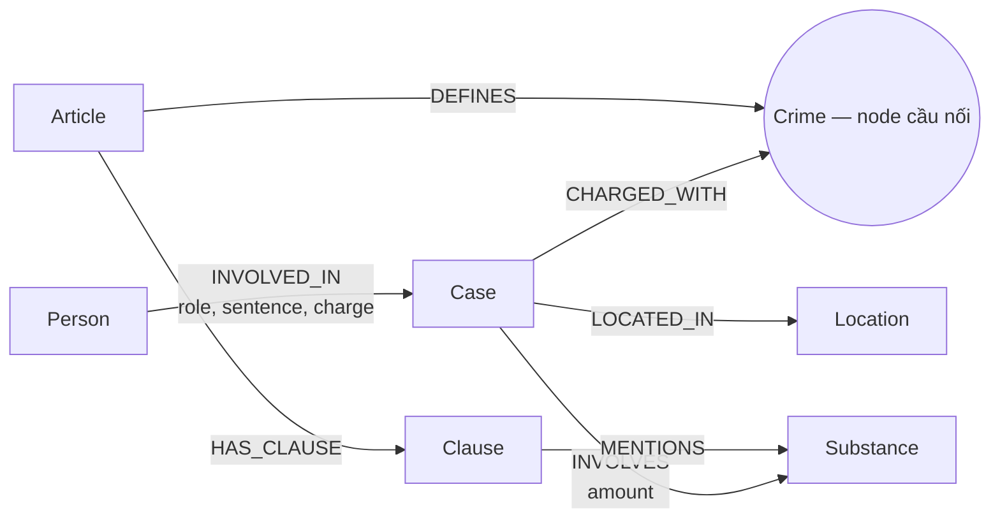

# Thiết kế Ontology — Day 19

**Họ tên:** Nguyễn Anh Tú  **MSSV:** 2A202602881

**Lựa chọn:**
- [x] Dùng ontology gợi ý (có thể chỉnh nhỏ)
- [ ] Tự thiết kế (xét bonus +15, xem `SUBMISSION.md`)

## 1. Sơ đồ

`Crime` là node cầu nối: tội danh chuẩn hóa liên kết vụ việc trong tin với Điều luật định nghĩa tội đó.

## 2. Entity types (node labels)

| Label | Ý nghĩa | Khóa định danh (`MERGE` theo) | Properties | Lấy từ KB nào | Trích bằng |
| --- | --- | --- | --- | --- | --- |
| `Article` | Một Điều luật | `id` | `title`, `law`, `doc_id` | Luật | Regex/front matter |
| `Clause` | Một khoản của Điều | `id` | `number`, `penalty`, `text`, `doc_id` | Luật | Regex |
| `Crime` | Tội danh chuẩn hóa | `name` | `name` | Cả hai | Regex từ tiêu đề luật; LLM rồi `link_entity` từ tin |
| `Substance` | Chất ma túy hoặc tên chất chuẩn | `name` | `name` | Cả hai | So khớp danh sách chuẩn trong luật; LLM trong tin |
| `Case` | Vụ việc/sự kiện cụ thể trong một bài báo | `name` | `summary`, `date`, `source_title`, `doc_id` | Tin | LLM |
| `Person` | Người liên quan một vụ việc | `name` | `aliases` | Tin | LLM |
| `Location` | Địa điểm của vụ việc | `name` | `name` | Tin | LLM |

Mọi node được tạo trực tiếp từ đúng một tài liệu đều mang `doc_id` của `Document` nguồn. Các node chuẩn dùng chung (`Crime`, `Substance`, và có thể `Person`/`Location` nếu xuất hiện ở nhiều bài) được gộp theo khóa định danh nên không nhất thiết có một `doc_id` duy nhất.

## 3. Relationships

| Type | Từ → Đến | Properties trên cạnh | Ý nghĩa |
| --- | --- | --- | --- |
| `DEFINES` | `Article` → `Crime` | — | Điều luật định nghĩa tội danh |
| `HAS_CLAUSE` | `Article` → `Clause` | — | Điều luật gồm khoản |
| `MENTIONS` | `Clause` → `Substance` | — | Khoản đề cập/ngưỡng áp dụng cho chất |
| `CHARGED_WITH` | `Case` → `Crime` | — | Vụ việc bị điều tra, truy tố hoặc xét xử về tội danh |
| `INVOLVES` | `Case` → `Substance` | `amount` | Vụ việc có chất ma túy và khối lượng được nêu |
| `LOCATED_IN` | `Case` → `Location` | — | Địa điểm chính của vụ việc |
| `INVOLVED_IN` | `Person` → `Case` | `role`, `sentence`, `charge` | Người tham gia vụ việc; vai trò, mức án và tội danh riêng nếu bài báo nêu |

## 4. Node cầu nối giữa 2 KB

- **Node nào:** `Crime`.
- **Vì sao chọn node này:** tin tức nêu hành vi/tội danh của vụ án, còn BLHS định nghĩa tội danh theo từng Điều. Vì vậy có thể đi từ người và vụ án sang Điều và khoản luật mà không suy đoán chỉ từ tên chất.
- **Cách đảm bảo hai phía khớp tên:** `normalize_crime` chuyển về chữ thường, bỏ tiền tố `Tội` và chuẩn hóa khoảng trắng. `link_entity` so khớp chính xác trước, sau đó dùng fuzzy matching với ngưỡng 0,8 và luôn trả lại tên chuẩn có trong KB luật. Prompt LLM cũng cung cấp danh sách tội danh chuẩn.
- **Khi nào cầu gãy, và cách xử lý:** cầu gãy khi bài báo chỉ mô tả hành vi, dùng tội danh ngoài phạm vi Điều 247–259, hoặc LLM trích sai/thiếu tội danh. Khi đó không tạo `CHARGED_WITH` tùy tiện; giữ dữ kiện tin tức, để câu trả lời nêu thiếu thông tin thay vì nối sai. Có thể cải thiện sau bằng alias/từ điển tội danh và kiểm tra thủ công những trường hợp không liên kết được.

## 5. Competency questions

| Câu | Đường đi (Cypher pattern) | Trả lời được? |
| --- | --- | --- |
| Q1 | `(:Article {id:'Điều 2 Luật PCMT'})-[:HAS_CLAUSE]->(:Clause {number:4})` | Có; lấy nguyên văn định nghĩa tiền chất. |
| Q2 | `(:Person {name:'Trần Thanh Tuấn'})-[:INVOLVED_IN {sentence:'tử hình'}]->(:Case)<-[:INVOLVED_IN {sentence:'tử hình'}]-(:Person {name:'Trần Minh Tâm'})` | Có; truy từ vụ 36kg ma túy và đọc `sentence`. |
| Q3 | `(:Person {name:'Lê Minh Thành'})-[:INVOLVED_IN]->(:Case)-[:CHARGED_WITH]->(:Crime)<-[:DEFINES]-(:Article)-[:HAS_CLAUSE]->(:Clause {number:1})` | Có; `sentence` cho 36 tháng, `Crime` dẫn sang Điều 251 và khoản cơ bản. |
| Q4 | `(:Person {aliases:['Hoàng Nato']})-[:INVOLVED_IN]->(:Case)-[:CHARGED_WITH]->(:Crime)<-[:DEFINES]-(:Article)-[:HAS_CLAUSE]->(:Clause)` | Có; lọc khoản có khung cao nhất của Điều 255. |
| Q5 | `(:Person {name:'Cái Quang Huy'})-[:INVOLVED_IN]->(:Case)-[:INVOLVES]->(:Substance {name:'MDMA'})` và `(:Case)-[:CHARGED_WITH]->(:Crime)<-[:DEFINES]-(:Article)-[:HAS_CLAUSE]->(:Clause)-[:MENTIONS]->(:Substance {name:'MDMA'})` | Có; dùng `amount` và khoản MDMA tương ứng để lấy khoản 4 Điều 250. |
| Q6 | `(:Case)-[:INVOLVES]->(:Substance {name:'MDMA'})` và `(:Person)-[:INVOLVED_IN]->(:Case)` | Có; gom các vụ việc liên quan MDMA. |

## 6. Quyết định thiết kế và đánh đổi

1. **Dùng `Crime` làm cầu nối thay vì `Substance`.** `Crime` nối trực tiếp vụ án với Điều luật, chính xác cho câu hỏi về tội danh và khung phạt. `Substance` có độ phủ rộng hơn nhưng một chất có thể xuất hiện trong nhiều Điều nên dẫn đến Điều luật không liên quan.
2. **Mô hình hóa `Clause` là node riêng.** Điều này cho phép trả về đúng khoản và khung phạt; lưu mọi khoản trong property của `Article` đơn giản hơn nhưng khó truy vấn/lọc theo chất. Đổi lại graph có thêm node và cạnh.
3. **Lưu mức án, vai trò, tội danh theo từng người trên cạnh `INVOLVED_IN`.** Một người có thể xuất hiện ở nhiều vụ hoặc có vai trò khác nhau, nên property cạnh tránh gán sai dữ kiện giữa các vụ. Lưu trên `Person` ít cạnh hơn nhưng làm mất ngữ cảnh.
4. **Regex cho luật, LLM có JSON mode cho tin.** Luật có cấu trúc đều nên regex rẻ, nhanh và tái lập được; tin là văn xuôi tự do nên cần LLM. Đổi lại phần tin có rủi ro sai/thiếu trích xuất, cần chuẩn hóa và kiểm chứng liên kết.

## 7. So với ontology gợi ý (bắt buộc nếu xét bonus)

Không xét bonus: bài này sử dụng ontology gợi ý để tập trung hoàn thiện đúng hợp đồng KG-1 đến KG-4.

## 8. Hạn chế còn lại

- `Case` và `Person` được gộp theo tên do LLM sinh, nên có thể trùng tên hoặc tách cùng một thực thể thành nhiều node.
- `Substance` chưa xử lý đầy đủ đồng nghĩa/biến thể (ví dụ tên lóng), nên có thể bỏ sót khi liên kết luật và tin.
- Khối lượng hiện là chuỗi `amount` trên cạnh `INVOLVES`; graph chưa có mô hình ngưỡng định lượng để tự suy luận khoản luật một cách xác định.
- Dữ kiện tội danh, mức án và vai trò phụ thuộc LLM trích xuất từ tin; graph không thay thế việc đối chiếu văn bản gốc.
